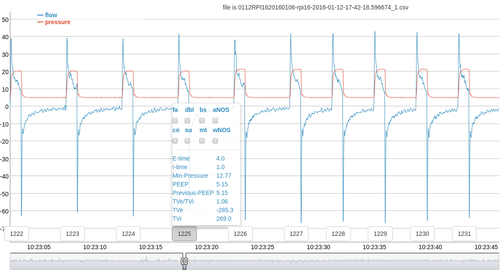

# ventMAP
Open source multi-purpose ventilator analytics library for use analyzing ventilator waveform data.

Currently only data output from the Purittan Bennet 840 (PB-840) is supported, but we welcome
contributions to support addition of other ventilators as well.

## Citing
If you make use of this library in your own work please cite our work :bowtie:.

    @article{adams2017development,
      title={Development and validation of a multi-algorithm analytic platform to detect off-target mechanical ventilation},
      author={Adams, Jason Y and Lieng, Monica K and Kuhn, Brooks T and Rehm, Greg B and Guo, Edward C and Taylor, Sandra L and Delplanque, Jean-Pierre and Anderson, Nicholas R},
      journal={Scientific reports},
      volume={7},
      number={1},
      pages={14980},
      year={2017},
      publisher={Nature Publishing Group}
    }

## Motivation

So you've been collecting data from some ventilators in your hospital or wherever, and you
want to analyze it. So you want to go from having a bunch of flow and pressure observations
and move to having some actionable information. Something similar to what this image is showing:



If this is your problem, then ventMAP is the platform that you need. The purpose of this README
is to give basics on how to use ventMAP. The rest on how to use the information is up to you.

## Install
`ventmap` is supported for use on both Python2 and Python3 as of version `1.3`.
Versions `1.2` and below only support Python2

    # make sure you have python virtualenv with anaconda
    conda create -name ventmap python=3.7

    # OR make sure you have python2 with pipenv
    pipenv --python=3.7

    #if using anaconda then activate your new environment
    #source activate ventmap

    #activate pipenv environment otherwise
    #pipenv shell

    pip install ventmap

## Data Format
Raw ventilator data needs to be formatted in an expected way in order for our software to read it.
The following section describes how our software can understand ventilator data for the following
ventilators:

### PB-840
PB-840 data should be in the following format

    <breath1 start datetime stamp>
    BS, S:<vent BN 1>
    <breath info>
    BE
    <breath2 start datetime stamp>
    BS, S:<vent BN 2>

Example:

    2016-12-15-11-54-58.672431
    BS, S:15428,
    2.56, 12.94
    4.20, 12.96
    7.37, 13.11
    17.18, 13.80
    30.18, 14.91
    44.12, 16.80
    58.95, 19.03
    67.63, 21.94
    69.67, 25.05
    56.72, 28.04
    50.02, 28.38
    45.57, 27.94
    44.99, 27.20
    45.53, 26.90
    44.35, 26.86
    43.82, 26.90
    ...
    BE
    2016-12-15-11-55-04.972431
    BS, S:15429,
    4.34, 12.81
    4.64, 12.78
    8.99, 12.89
    19.83, 13.62
    31.61, 14.97
    47.10, 16.95
    ...
    BE
    ...

If there is no timestamp above the breaths then the software will use relative time counting
from 0 from the start of the file as a timestamp. The downside of this is that ventilator
data cannot actually be temporally linked with other types of patient data in the future.

## API

### Basics
For reading ventilator data:

```python
from io import open  # this import ensures python 2/3 compatibility

from ventmap.raw_utils import PB840File

# create generator that will iterate through file. Specify False to ensure that
# breaths without BE markers will be kept. If you say True, then breaths
# without BE will be dropped. This can occasionally happen due to software error
# or because a breath was cutoff at the end of a file.
generator = PB840File(open(<filepath to vent data>)).extract_raw(False)
for breath in generator:
    # breath data is output in dictionary format
    flow, pressure = breath['flow'], breath['pressure']
```

This process only works if you are using the Puritan Bennet 840. However if you have a different
ventilator then you can utilize this too. VentMap currently supports 100 Hz data input files in
same format as the PB-840.

```python
from io import open

from ventmap.raw_utils import HundredHzFile

generator = HundredHzFile(open(<filepath to vent data>)).extract_raw(False)
for breath in generator:
    # breath data is output in dictionary format
    flow, pressure = breath['flow'], breath['pressure']
```


If you want to preprocess a breath file for later usage, or if you intend to
process it again then it is suggested to use the `process_breath_file` method

```python
from io import open

from ventmap.raw_utils import process_breath_file, read_processed_file

# This function will output 2 files. The first will just contain raw breath data
# the other will contain higher level processed data. In order to re-load the
# saved data we just need to specify the path to the raw file
process_breath_file(open(<filepath>), False, 'new_filename')
raw_filepath_name = 'new_filename.raw.npy'

for breath in read_processed_file(raw_filepath_name):
    # breath data is output in dictionary format
    flow, pressure = breath['flow'], breath['pressure']
```

For extracting metadata (I-Time, TVe, TVi) from files.

```python
from ventmap.breath_meta import get_file_breath_meta

# Data output is normally in list format. Ordering information can be found in
# ventmap.constants.META_HEADER.
breath_meta = get_file_breath_meta(<filepath to vent data>)
# If you want a pandas DataFrame then you can set the optional argument to_data_frame=True
breath_meta = get_file_breath_meta(<filepath to vent data>, to_data_frame=True)
```


For extracting metadata from individual breaths

```python
from io import open
# production breath meta refers to clinician validated algorithms
# experimental breath meta refers to non-validated algorithms
from ventmap.breath_meta import get_production_breath_meta, get_experimental_breath_meta
from ventmap.raw_utils import PB840File, read_processed_file

generator = PB840File(open(<filepath to vent data>)).extract_raw(False)
# OR
generator = read_processed_file(<raw file>, <processed data file>)

for breath in generator:
    # Data output is normally in list format. Ordering information can be found in
    # ventmap.constants.META_HEADER.
    prod_breath_meta = get_production_breath_meta(breath)
    # Ordering information can be found in ventmap.constants.EXPERIMENTAL_META_HEADER.
    experimental_breath_meta = get_experimental_breath_meta(breath)
```

### Consolidating Files

If you have a bunch of files that are fragments and you'd like to merge them together
then you can consolidate them together into a new .csv or .npy file.

```python
from ventmap.raw_utils import consolidate_files

file_paths = ['/path/to/file1.csv', '/path/to/file2.csv', ...]
output_dir = '/path/to/output'

# Provide False in second argument if we need to have BE markers
# outputs files to single npy file
consolidate_files(file_paths, False, output_dir)

# output to files to single csv and npy file
consolidate_files(file_paths, False, output_dir, to_csv=True)

# output to single csv file
consolidate_files(file_paths, False, output_dir, to_npy=False, to_csv=True)
```

### Main Breath Metadata

The breath metadata are processed pieces of clinically relevant data that are derived from the raw ventilator waveform
data. This information can be utilized to do a variety of different things including: analyzing patient ventilator settings,
or making machine learning classifiers. The exact pieces of metadata output from the `breath_meta` functions are labeled,
and are documented here:

| Name | Units | Description |
| --- | --- | --- |
| BN | N/A | relative breath number in a file |
| ventBN | N/A | ventilator breath number |
| BS | seconds | relative breath start time |
| IEnd | seconds | relative time that inspiration ended |
| BE | seconds | relative time that the breath ended |
| I:E ratio | N/A | ratio of inspiratory/expirator time |
| iTime | seconds | amount of time elapsed on inspiration |
| eTime | seconds | amount of time elapsed on expiration |
| inst_RR | breaths/min | total amount of time elapsed on the breath divided by 60 |
| tvi | ml | amount of air breathed in |
| tve | ml | amount of air breathed out |
| tve:tvi ratio | N/A | ratio of tve divided by tvi |
| maxF | L/min | maximum flow on the breath |
| minF | L/min | minimum flow on the breath |
| maxP | mmH2O | maximum pressure on the breath |
| PIP | mmH2O | maximum pressure during inspiration |
| Maw | mmH2O | mean of all pressure readings over breath |
| PEEP | mmH2O | positive end expiratory pressure |
| ipAUC | mmH2O | area under the inspiratory pressure curve |
| epAUC | mmH2O | area under the expiratory pressure curve |
| placeholder | N/A | Legacy column |
| BS.1 | N/A | Legacy column |
| x01 | N/A | Legacy column |
| tvi1 | N/A | Legacy column |
| tve1 | N/A | Legacy column |
| x02 | N/A | Legacy column |
| tvi2 | N/A | Legacy column |
| tve2 | N/A | Legacy column |
| x0_index | N/A | index in observation array when inspiration ends |
| abs_time_at_BS | date | absolute time breath started |
| abs_time_at_x0 | date | absolute time that inspiration ended |
| abs_time_at_BE | date | absolute time that breath ended |
| rel_time_at_x0 | N/A | Legacy column |
| rel_time_at_BE | N/A | Legacy column |
| min_pressure | mmH20 | minimum pressure for the inspiratory section of the breath |

### Experimental Breath Metadata
We also have some pieces of more experimental information that have been developed since our 2017 paper.

| Name | Units | Description |
|---|---|---|
| slope_minF_to_zero | N/A | The slope of the line from PEF (peak expiratory flow to where flow is zero |
| pef_+0.16_to_zero | N/A | The slope of the line from the point of PEF+0.16 seconds to where flow is zero. The 0.16 seconds is added because many COPD patients have elastic recoil that causes their expiratory flow to decrease sharply after about 0.16 seconds |
| mean_flow_from_pef | L/min | The mean expiratory flow |
| dyn_compliance | ml / sec*mmHg | The [dynamic compliance of a patient's lungs](https://en.wikipedia.org/wiki/Lung_compliance) |
| vol_at_.5_sec | ml/sec | The volume of air expelled on expiration after 0.5 seconds |
| vol_at_.76_sec | ml/sec | The volume of air expelled on expiration after 0.76 seconds |
| vol_at_1_sec | ml/sec | The volume of air expelled on expiration after 1 second |
| pressure_itime_4 | seconds | Calculate pressure I-time by finding first point moving from back of the breath where pressure goes over PEEP+4mmHg |
| pressure_itime_5 | seconds | Calculate pressure I-time by finding first point moving from back of the breath where pressure goes over PEEP+5mmHg |
| pressure_itime_6 | seconds | Calculate pressure I-time by finding first point moving from back of the breath where pressure goes over PEEP+6mmHg |
| pressure_itime_by_pip5 | seconds | Calculate pressure I-time by finding first point moving from back of the breath where pressure goes over PIP-5mmHg |
| pressure_itime_by_pip6 | seconds | Calculate pressure I-time by finding first point moving from back of the breath where pressure goes over PIP-6mmHg |
| pressure_itime_from_front | seconds | First calculate threshold = `(PIP-PEEP)*x` where `0<=x<=1`. In practice we use x=0.4. Then, starting from front of the breath, determine where pressure goes above the `PIP-threshold`, this will be the start of the pressure I-time. Next determine next point where pressure goes below `PIP-threshold`. This will be the end of the pressure I-time. In practice we have found this algorithm to be the most stable |

### Extras

Clear null bytes from a file

```python
from io import open

from ventmap.clear_null_bytes import clear_descriptor_null_bytes

cleared_descriptor = clear_descriptor_null_bytes(open(<filepath to vent data>))
```

Cut a file into specific BN interval and store for later use

```python
from io import open

from ventmap.cut_breath_section import cut_breath_section

# get file descriptor for the truncated data
new_descriptor = cut_breath_section(open(<filepath to vent data>), <breath start num>, <breath end num>)
# write output to file
with open('new_file', 'w') as f:
    f.write(new_descriptor.read())
```

Check if there is a plateau pressure in a breath


```python
from io import open

from ventmap.raw_utils import extract_raw
from ventmap.SAM import check_if_plat_occurs

generator = extract_raw(open(<filepath to vent data>), False)
for breath in generator:
    flow, pressure = breath['flow'], breath['pressure']

    # .02 is the sampling rate for the PB-840 corresponding with 1 obs every .02 seconds
    did_plat_occur = check_if_plat_occurs(flow, pressure, .02)
```
